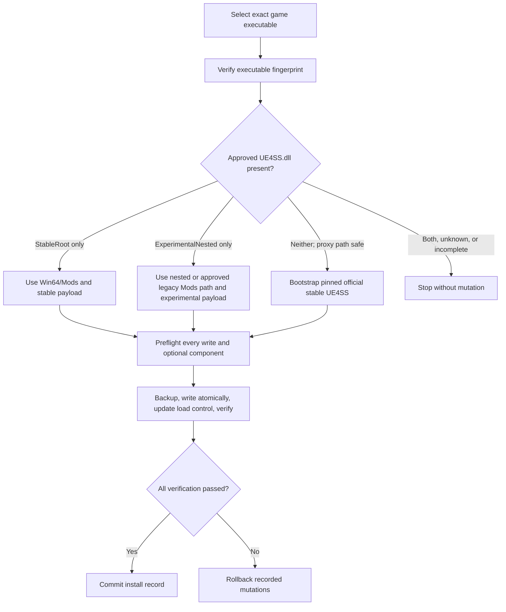

# DragonSword Mod One-Click Installer Standard

## Purpose

Use this standard when a DragonSword Mod needs a public Windows installer that
can be reused across the official stable UE4SS layout and the owner's
experimental nested layout. The installer must make a supported decision from
exact files and fingerprints; a directory name alone is not compatibility
evidence.

This standard covers installation mechanics. Each Mod still owns its runtime,
data generation, configuration schema, third-party notices, and gameplay
acceptance.

## 1. Define a product profile first

Copy `docs/templates/INSTALLER_PRODUCT_PROFILE.template.json` into the target
project's metadata directory and replace every placeholder. At minimum, lock:

- product name and version;
- exact `DSClient-Win64-Shipping.exe` fingerprints supported by the release;
- supported UE4SS loader and proxy fingerprints;
- payload variant for each supported layout;
- one load-control authority;
- public configuration defaults;
- user-owned files that upgrades must preserve;
- optional components and their exact hashes;
- generated data and installation-time prerequisites;
- validation and gameplay-acceptance state.

Do not start with UI code. The profile is the fail-closed contract used by the
builder, installer, tests, documentation, and release manifest.

## 2. User-facing flow

The minimum UI is a single elevated Windows executable with:

- a file picker restricted to `DSClient-Win64-Shipping.exe`;
- a clear detected-layout result;
- product-specific options, with safe public defaults;
- an optional-component checkbox when the product owns a separate PAK;
- an Install button, progress/status area, and actionable failure text;
- a success summary containing layout, selected options, and backup location.

When a Mod synthesizes or injects a configurable game input, expose the binding
contract explicitly. Prefer a semantic automatic lookup as the primary route
and a separately stored user-selected fallback key as insurance. The fallback
must have a visible safe default, be validated before mutation, and be written
to a runtime setting the Mod actually consumes. Never show an installer control
that is only cosmetic. Changing the fallback must not silently change the
installer's own toggle key.

The game must be closed. The installer must never terminate it automatically.

### 2.1 Current native Pickup / Radar key-editing contract (2026-09-07)

This interaction contract applies to Pickup 1.3.1 and Native World Radar 2.3.0
Setup. Product-owned current installer documentation takes precedence over
historical layout/ABI examples elsewhere in this standard.

- Inspect the selected game and load its existing key values; otherwise show
  safe public defaults. Reload when the game path changes, not on every click.
- Expose editable key selectors during Install, Update, and Repair. Do not
  silently substitute installed old keys for an explicit new selection.
- Validate before mutation. Show the normalized selected keys, target, optional
  changes, and conversion warning in a default-No confirmation. Execute those
  exact plan values, with a token binding both source state and selections.
- Preserve uncommitted choices on cancellation or failure. After success,
  reinspect persisted values. Reject stale configuration or selection tokens.
- For owned config, replace only selected key value spans; keep unrelated
  settings, separate comments, spacing, and line endings. Unchanged valid
  canonical values leave the file byte-identical. Do not enable public debug.
- Include configuration edits in existing verified transaction/rollback paths.
  Never introduce an untracked post-install configuration write.
- Test custom fresh/update/repair keys, no-op exact bytes, invalid selections,
  stale plans, form reload behavior, and late-write rollback independently from
  real elevated UI and gameplay acceptance.

Pickup keeps Toggle + Interaction fallback and its optional range selector.
Fallback is a concrete Unreal key, not AUTO; the separate runtime interaction
mode remains unchanged. Radar keeps Settings + Enable + Disable and requires
three distinct keys. The native key vocabularies, configuration parsers,
ownership rules, and UE4SS compatibility policies are not merged.

## 3. Supported UE4SS layouts

| Layout | Loader | Proxy | Normal Mods root |
|---|---|---|---|
| StableRoot | `Win64/UE4SS.dll` | `Win64/dwmapi.dll` | `Win64/Mods` |
| ExperimentalNested | `Win64/ue4ss/UE4SS.dll` | `Win64/dwmapi.dll` | `Win64/ue4ss/Mods` |

ExperimentalNested may use an existing legacy `Win64/Mods` only when the
nested Mods directory is absent and the legacy directory already exists. Parse
approved relative `ControllingModsTxt` and additional Mods paths relative to
the loader's real working directory. If ownership becomes ambiguous, stop.

Rules:

1. Verify both `UE4SS.dll` and `dwmapi.dll`; neither the folder nor one DLL is
   sufficient.
2. If both supported loader layouts exist, do not guess which one is active.
3. If an existing loader or proxy hash is unknown, do not overwrite it.
4. If UE4SS is completely absent, bootstrap only a hash-pinned official stable
   archive embedded by the release builder.
5. Preserve existing settings, `mods.txt`, and built-in Mod files during
   bootstrap. Fill missing support files; do not replace user-owned files.
6. Reject unsupported game-specific working directories until the product has
   an explicit, tested routing rule for them.
7. A Lua-only product may use one payload for both layouts. A native C++ product
   must build and select separate payloads whenever the two UE4SS SDK/ABI pins
   are not byte-compatible.

## 4. Load-control policy

Choose one authority and record it in the product profile.

The preferred policy for a new installer is exactly one normalized
`<ModName> : 1` or `<ModName> : 0` entry in the controlling `mods.txt`. Preserve
unrelated lines, byte-order mark, newline style, and unrelated comments.
Normalize duplicate valid entries and fail on malformed same-name entries.

If legacy `enabled.txt` bypasses the selected authority, back it up and remove
it. Do not silently apply this policy to an existing Mod that intentionally
uses `enabled.txt`; migration requires a product-specific decision and tests.

Search all approved additional Mods roots for a competing same-name entry or
legacy enablement file. The installer must not leave two independent control
sources active.

## 5. Configuration and upgrades

Separate three classes of files:

- public defaults owned by the release;
- user-owned configuration and overrides preserved across upgrades;
- generated runtime/install data that may be rebuilt only from validated input.

Public release configuration must not inherit a developer's local diagnostic
override. If local testing requires Debug On, change only the installed copy
after packaging and record that exact difference.

Validate configuration before any write. Preserve only settings explicitly
declared user-owned; stale fields must be migrated by a versioned function or
rejected with an actionable error.

For a configurable interaction binding, record all three states separately:

- automatic semantic binding mode enabled or disabled;
- explicit fallback key and its validated key-name vocabulary;
- reload boundary, such as each enable transition or game restart.

Installer tests must prove the default fallback and at least one non-default
value, plus preservation across an upgrade. Runtime acceptance must still test
the resulting key inside the game.

## 6. Optional PAK components

An optional PAK is independent from the main Mod unless the product contract
explicitly says otherwise.

- The checkbox controls only the exact product-owned filename and hash.
- Recheck its state immediately before installation, not only when the file
  picker changes.
- Back up an approved existing artifact before replacing or removing it.
- Never overwrite or delete an unknown same-name PAK.
- Reject a known legacy artifact when it would conflict and ownership cannot be
  proven.
- Install only under the validated game PAK subtree.
- State clearly whether removing the PAK requires a game restart.

## 7. Transaction and path safety

Complete all cheap validation before creating a backup directory. Then:

1. derive the DS/game/Win64/Mods/PAK paths from the selected executable;
2. canonicalize every path and prove it remains inside the intended game tree;
3. reject reparse points or junctions on every path from the trusted root to a
   write target;
4. repeat the path-safety check immediately before each write and rollback;
5. back up every existing file that may change;
6. write a temporary file in the destination directory and use atomic replace
   or move;
7. record every mutation in order;
8. verify installed hashes, configuration, load control, and optional state;
9. on failure, roll back recorded mutations in reverse order;
10. write an install or rollback record containing exact hashes and paths.

Do not recursively delete a guessed path. Empty directories left after a failed
transaction are acceptable when removing them would broaden destructive scope.

The AutoPickup reference reduces practical path races but does not provide a
durable write-ahead journal or handle-relative Windows filesystem security.
Document those limits rather than claiming crash-proof or adversarially atomic
installation.

## 8. Single-executable implementation

The proven reference is a .NET Framework 4.8 WinForms executable built with the
Visual Studio Roslyn compiler and an administrator manifest. It embeds:

- every layout-specific Mod payload;
- public configuration and passive entry files;
- the pinned official UE4SS bootstrap archive;
- optional product-owned PAKs;
- a generated payload manifest with SHA-256 values;
- third-party notices.

At runtime, load embedded resources by exact name, verify them against the
embedded manifest, and choose only the payload matching the detected layout.
Build deterministically where practical and emit a sidecar SHA-256 file. Unless
the executable is code-signed, identify it as unsigned in the UI and release
documentation; a successful build is not a trust signature.

## 9. Required isolated installer tests

Build temporary fake game trees from one real supported executable fixture and
approved loader fixtures. At minimum test:

1. bare tree bootstraps official stable UE4SS;
2. bootstrap preserves settings, `mods.txt`, and existing built-in Mod files;
3. existing StableRoot installation;
4. existing ExperimentalNested installation;
5. ExperimentalNested legacy `Win64/Mods` fallback;
6. approved relative controlling/additional Mods paths;
7. ambiguous dual layout, unknown loader, and incomplete loader fail without
   mutation;
8. missing and wrong proxy for every layout fail without mutation;
9. `mods.txt` BOM/newline/comments/unrelated entries survive normalization;
10. public configuration and custom installer options are correct;
11. optional PAK install and explicit removal;
12. unknown same-name and unowned legacy PAK conflicts fail without mutation;
13. a real junction/reparse write target is rejected without mutation;
14. a late injected write failure restores every recorded file mutation.

When a manual-install channel is published, test it as a separate product
route. Extract it into clean fixtures for every declared layout, verify its
exact tree and hashes, apply its documented load-control step, and compare the
resulting runtime payload with the equivalent Setup installation. A manual ZIP
must not bypass compatibility, configuration, or ownership gates merely because
the user performs the copy.

The release builder must require the exact expected pass/fail/skip counts. A
test runner that exits successfully after silently skipping a security case is
not a release gate.

## 10. Definition of done

An installer is ready for owner testing only when:

- the product profile is complete and contains no borrowed hashes;
- all source, build, payload, and installer tests pass;
- the public artifact contains only the declared files;
- a clean and an upgrade installation both verify exact installed hashes;
- the public/default and local/debug configurations are demonstrably separate;
- rollback has an exact backup path;
- no third-party Mod is bundled without an explicit redistribution right;
- Setup and every documented manual channel install equivalent versioned
  runtime bytes except for explicitly declared user choices;
- gameplay acceptance remains marked pending until the owner tests the exact
  installed artifact.

## 11. Reference implementation seams

The AutoPickup installer is currently product-specific, but these sections are
the safest starting points for a future shared utility:

- `InstallerPathSafety` in `installer/InstallerEngine.cs`: canonical game-tree
  containment and reparse/junction rejection;
- `InstallTransaction` in the same file: ordered backups, same-directory atomic
  replacement, reverse rollback, and install/rollback records;
- the same file's encoding and SHA-256 helpers: byte-preserving text handling
  and payload verification;
- `installer/Program.cs` and `installer/app.manifest`: WinForms entry point and
  elevation pattern;
- `tools/Build-Installer.ps1`: deterministic .NET Framework 4.8 single-EXE
  compilation and embedded resources;
- `tools/Build-Release.ps1`: installer-first allowlist, checksum, archive, and
  manifest pattern;
- `installer/tests/InstallerIntegration.Tests.ps1`: isolated fixture and
  rollback-test architecture.

Layout detection, bootstrap resources, UI options, payload names, hashes,
`mods.txt` policy, expected test count, and success text still contain product
decisions. Parameterize them through the product profile; do not call the
current AutoPickup executable or engine a generic installer library.
